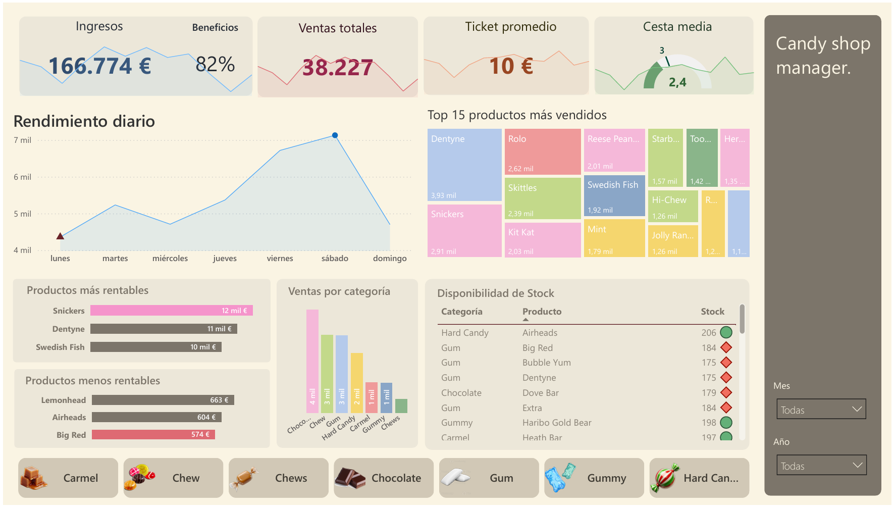
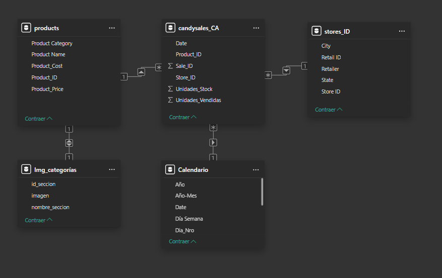
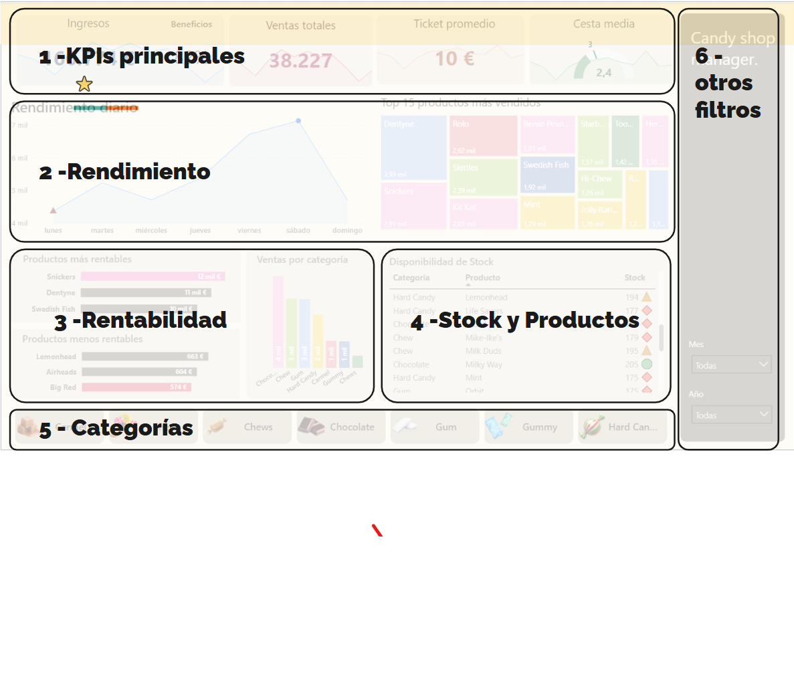

# Candy Shop Sales Insights 🍭

## 📌 Introducción
Este proyecto transforma datos brutos de retail en una herramienta estratégica para la toma de decisiones operativas. Para garantizar un escenario de negocio realista, se ha utilizado una base de datos de **Kaggle**, sobre la cual se ha ejecutado un ciclo completo de análisis: **ETL**, **Modelado de Datos** y **Diseño de Interfaz (UX/UI)**.

 

 

---

## 🛠️ Proceso Técnico

### 1. ETL y Preparación de Datos
El proceso de **Extracción, Transformación y Carga (ETL)** fue clave para convertir archivos CSV dispersos en un modelo de datos coherente:
* **Limpieza y Normalización**: Se procesaron las tablas `candysales_CA` y `products` para asegurar la integridad referencial.
* **Inteligencia de Tiempo**: Se creó una **Tabla de Calendario** para desglosar ventas por año, mes y día de la semana, permitiendo identificar patrones estacionales.

 

  

 

### 2. Modelado de Datos
Se implementó un **Esquema en Estrella** para optimizar el rendimiento de las consultas DAX:
* **Tabla de Hechos**: `candysales_CA` (Ventas y Stock).
* **Tablas de Dimensiones**: `products` (Atributos y precios), `stores_ID` (Geografía), `Calendario` e `Img_categorías`.

---

## 🎨 Diseño UX/UI y Estrategia Visual
El dashboard utiliza un **Diseño Orientado a la Acción**, estructurado para guiar al usuario a través de un flujo de lectura en **"Z"**:

 

  

 

1.  **KPIs Principales**: Salud financiera inmediata (Ingresos, Beneficios, Ticket Promedio) con contexto histórico mediante *sparklines*.
2.  **Rendimiento Operativo**: Monitorización del pulso diario de la tienda y detección del "Top 15" de productos.
3.  **Rentabilidad**: Análisis comparativo de márgenes para la optimización del catálogo.
4.  **Stock y Productos**: Sistema de alertas críticas mediante indicadores visuales (círculos y rombos) para evitar roturas de stock.
5.  **Navegación Visual**: Menú inferior con iconografía intuitiva que reduce la carga cognitiva y facilita el filtrado táctil.

---

## 🚀 Valor de Negocio
Este panel dota al **Candy Shop Manager** de capacidades para:
* **Optimizar Staff**: Al identificar picos de venta los sábados.
* **Gestión de Inventario**: Alerta proactiva sobre productos con stock crítico.
* **Estrategia de Ventas**: Mejora del Ticket Promedio y la Cesta Media mediante el análisis de categorías.

---

## 🛠️ Tecnologías Utilizadas
* **Power BI Desktop**
* **Power Query (M)** para procesos ETL.
* **DAX** para métricas y KPIs complejos.
* **Kaggle Datasets** como fuente de datos.

"Nota de uso: Para visualizar el reporte completo, descarga el archivo .pbit y conéctalo a los archivos CSV ubicados en la carpeta /data cuando Power BI solicite la ruta de origen.

---
*Proyecto desarrollado por Elian - 2026*
