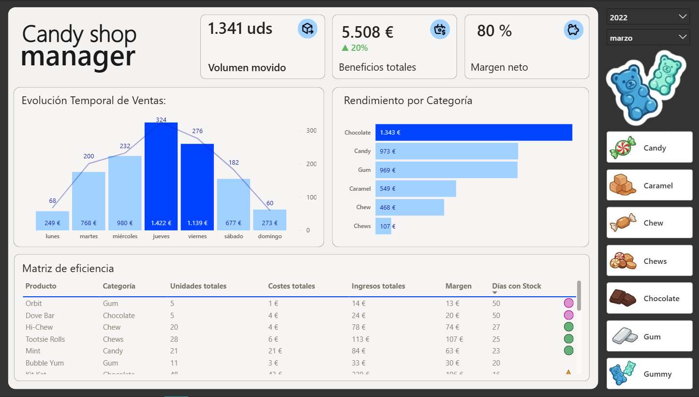
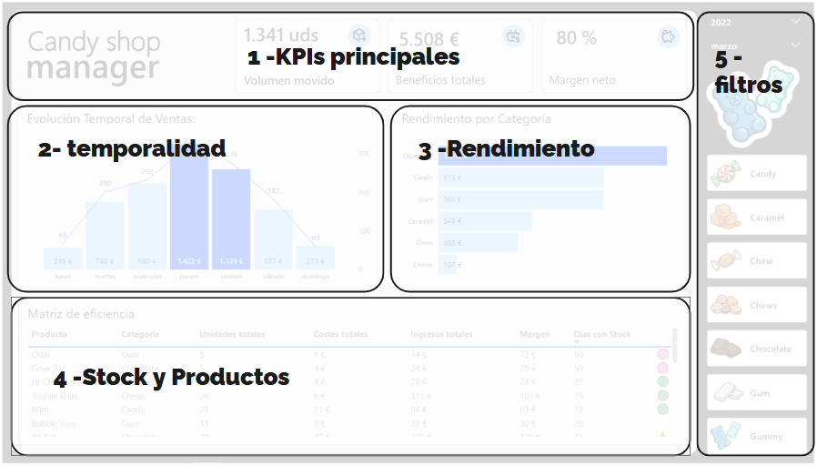
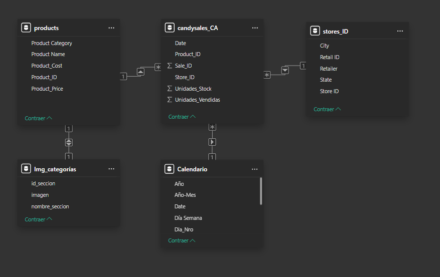

# Candy Shop Sales Insights: De gestionar a ciegas a gestionar con criterio

---

> "Veo entrar dinero en la caja, pero no tengo ni idea de cuál es mi beneficio real o qué dulces me están dejando más margen limpio. Voy siempre a remolque con el almacén: o me como los productos con patatas porque no se venden, o me quedo sin stock de los favoritos y tengo la vitrina vacía."

---

---

## El problema

El Candy Shop Manager tenía dos archivos CSV al final de cada día: uno con las ventas y otro con el catálogo de productos. El problema es que esos dos archivos no se hablaban entre sí. Podía ver cuánto entraba en caja, pero no cuánto ganaba realmente. Podía ver qué había vendido, pero no anticipar qué iba a necesitar reponer.

El resultado: decisiones de inventario reactivas, márgenes invisibles y ninguna visión sobre qué días, categorías o productos tiraban del negocio.

## Las preguntas que necesitaba responder

- ¿Cuánto estoy ganando realmente, no solo ingresando?
- ¿Qué productos me dan más margen y cuáles me están comiendo espacio en vitrina?
- ¿Cuándo vendo más? ¿Hay patrones semanales o estacionales que no estoy aprovechando?
- ¿Qué productos están a punto de agotarse antes de que me quede sin stock?

## Lo que construí

Un dashboard operativo en Power BI para que el manager pueda responder esas preguntas desde una sola pantalla, con filtros por año, mes y categoría.

**KPIs de cabecera** — Volumen movido (unidades), beneficios totales y margen neto. El estado del negocio en un vistazo antes de entrar en detalle.

**Evolución temporal** — Ventas por día de la semana con línea de tendencia superpuesta. Identifica en qué días concentrar esfuerzo de personal o stock.

**Rendimiento por categoría** — Barras comparativas de las 7 categorías del catálogo. Deja claro de dónde viene el dinero y dónde no.

**Matriz de eficiencia** — Tabla por producto con unidades, costes, ingresos, margen y días con stock. Los indicadores de color señalan en qué productos el stock se está agotando antes de que sea un problema.

El modelo se alimenta de más de 15.900 registros de ventas, 35 tipos de producto y 7 categorías.
---

## Backend técnico

**Fuente de datos:** Dataset de Kaggle — `candysales_CA.csv` (ventas) + `products.csv` (catálogo con costes y precios).

**ETL:** Power Query (M). Limpieza y normalización de ambas tablas, creación de tabla calendario para desglosar por año, mes y día de la semana.

**Modelado:** Esquema en estrella. Tabla de hechos: `candysales_CA`. Dimensiones: `products`, `stores_ID`, `Calendario`, `Img_categorías`.

**Métricas:** DAX para cálculo de beneficio neto, margen por producto, ticket promedio y lógica de alertas de stock por umbral.

**Diseño:** Flujo de lectura en Z. Iconografía de navegación inferior para reducir carga cognitiva. Diseño orientado a la acción: cada vista responde una pregunta de negocio concreta.

---

## Cómo usar el proyecto

Descarga el archivo `.pbit` y conéctalo a los archivos CSV en la carpeta `/data` cuando Power BI solicite la ruta de origen.

---

## Contacto

**Elian Daghoum** — Data Analyst & Visualization Specialist

[LinkedIn](https://www.linkedin.com/in/eliandaghoum) · [GitHub](https://github.com/Elian-digital) · eliandaghoum@gmail.com
